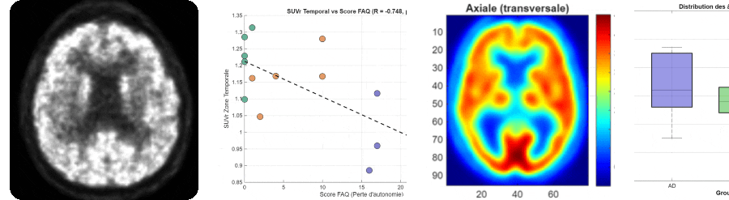
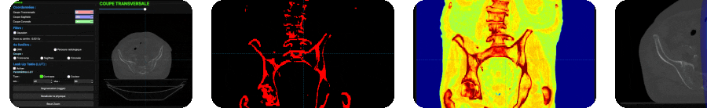
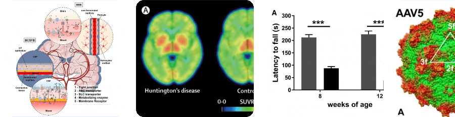
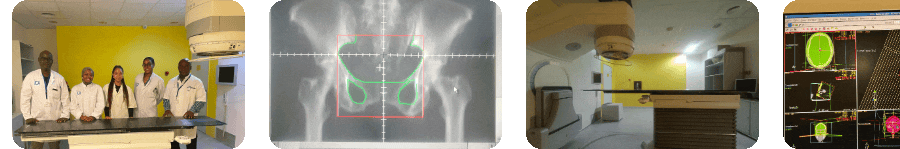

  

  

  
  

  <a href="#-sommaire--table-of-contents">Sommaire</a> •
  <a href="#-français">🇫🇷 Français</a> •
  <a href="#-english">🇬🇧 English</a> •
  <a href="#-compétences--technical-skills">Compétences</a>

  

## 📑 Sommaire / Table of Contents

| 🇫🇷 | 🇬🇧 |
| :--- | :--- |
| [📄 CV](#-curriculum-vitae) | [📄 Resume](#-resume--cv) |
| [📌 À propos](#-à-propos) | [📌 About](#-about) |
| [📂 Projets](#-projets-académiques) | [📂 Projects](#-featured-projects) |
| [🔬 Stages](#-stages--expériences) | [🔬 Experience](#-clinical--research-experience) |
| [🛠️ Compétences](#-compétences--technical-skills) | [🛠️ Skills](#-compétences--technical-skills) |

  

## 🇫🇷 Français

### 📄 Curriculum Vitae

  

**Domaines :** Radiophysique Médicale, Dosimétrie, Imagerie Médicale & Traitement d'Images.

  
  
  

  
  
  
  
  

<!-- À propos -->
###  À propos

> [!NOTE]
> Étudiante en Master 2 spécialisée en **physique médicale, dosimétrie et imagerie** (TEP, TEMP, IRM, Scanner, Échographie). Mon parcours associe la physique des rayonnements, la radiobiologie et le traitement d'images médicales à une pratique concrète en assurance qualité en radiothérapie, quantification métabolique TEP et développement logiciel en C++.

  

<!-- Projets -->
###  Projets académiques

#### 01. Quantification métabolique cérébrale dans la maladie d'Alzheimer (TEP/IRM)

  
  
  

| | |
| **Cadre** | Projet de Master 1 — *Toulouse NeuroImaging Center (ToNIC)* (Mars 2026 – Mai 2026) |
| **Rapport IEEE** | [`Projet Quantification TEP`](./Quantification_TEP_French_ver.pdf) |
| **Présentation** | [`Support de présentation orale`](./Presentation_Quantification_TEP.pdf) |

  

> [!TIP]
> **Sujet :** Analyse TEP des biomarqueurs cérébraux et des déficits métaboliques régionaux dans la maladie d'Alzheimer.
>
> **Points clés :**
> - Prétraitement de volumes cérébraux 3D sous **SPM12** (recalage spatial, normalisation MNI, interpolation trilinéaire).
> - Calcul des métriques SUV et SUVR (zone de référence : cervelet).
> - Analyse quantitative du métabolisme cérébral (cortex frontal, précunéus, cingulaire postérieur).

<a href="#-sommaire--table-of-contents">↑ Retour au sommaire</a>

  

#### 02. Interface de visualisation et de traitement d'images médicales (C++)

  
  
  
  

| | |
| :--- | :--- |
| **Cadre** | Projet de Master 1 — *Faculté des Sciences et d'Ingénierie, Toulouse* (Fév 2026 – Mai 2026) |
| **Présentation** | [`Présentation Projet C++`](./C++_Project_presentation.pdf) |

  

> [!TIP]
> **Points clés :**
> - Développement d'une interface interactive de visualisation 3D de données scanner DICOM en C++.
> - Filtrage gaussien 2D par convolution, tables de correspondance (LUT / Palette Jet).
> - Simulation de faisceau de radiothérapie, reconstruction de radiographies numériques (DRR) et segmentation anatomique temps réel.

<a href="#-sommaire--table-of-contents">↑ Retour au sommaire</a>

  

#### 🧬 03. Vectorisation et traitement de la maladie de Huntington

  
  

| | |
| :--- | :--- |
| **Cadre** | Projet de Licence — *Laboratoire SOFTMAT, Toulouse* (Sep 2024 – Jan 2025) |
| **Rapport IEEE** | [`Projet Vectorisation`](./Vectorisation_ieee.pdf) |
| **Présentation** | [`Support de présentation orale`](./Vectorisation_presentation.pdf) |

  

> [!TIP]
> **Points clés :**
> - Étude des stratégies de ciblage thérapeutique par vecteurs (AAV5/miRNA) franchissant la barrière hémato-encéphalique.
> - Analyse de données précliniques sur la réduction de la protéine mHTT.

  

<!-- Expériences / Stages -->
###  Stages & Expériences

> [!IMPORTANT]
> Expérience de terrain en milieu clinique et en laboratoire de recherche.

  
  
  
  

  

| Période | Poste | Structure | Missions clés |
| :--- | :--- | :--- | :--- |
| **Juin – Juil 2026** | 🏥 Stagiaire Physique Médicale | Institut de Cancérologie d'Akanda (ICA) | Assurance qualité LINAC, simulateur CT, calibrateur ISOMED · Contourage TPS (CTV, PTV) · Balistique de traitement |
| **Juin – Juil 2025** | 🧪 Stagiaire Recherche | Groupe PRHE — Laboratoire LAPLACE | Plasmas froids · Espèces réactives (ROS/RNS) · Décontamination biologique |

<a href="#-sommaire--table-of-contents">↑ Retour au sommaire</a>

  

## 🇬🇧 English

### 📄 Resume / CV

  

**Fields:** Medical Physics, Dosimetry, Medical Imaging & Image Processing.

  
  
  

  
  
  
  
  

### 📌 About

> [!NOTE]
> Master's student in **Medical Radiation Physics** (PET, SPECT, MRI, CT, Ultrasound). My academic background combines radiation physics, radiobiology, and medical image processing with hands-on experience in radiotherapy QA, PET metabolic quantification, and C++ software development.

  

### 📂 Featured Projects

#### 🧠 1. Brain Metabolic Quantification in Alzheimer's Disease (PET/MRI)

| | |
| :--- | :--- |
| **Context** | Master 1 Project — *Toulouse NeuroImaging Center (ToNIC)* (Mar 2026 – May 2026) |
| **Report** | [`TEP Quantification Project`](./Quantification_TEP_eng_ver.pdf) |

> [!TIP]
> **Highlights:**
> - 3D brain volume preprocessing using **SPM12** (spatial registration, MNI normalization, interpolation).
> - SUV and SUVR metrics calculation using the cerebellum as reference region.
> - Regional metabolic quantification in key brain areas (frontal cortex, precuneus, posterior cingulate).

<a href="#-sommaire--table-of-contents">↑ Back to top</a>

  

#### 💻 2. Medical Image Visualization & Processing Interface (C++)

| | |
| :--- | :--- |
| **Context** | Master 1 Project — *Faculty of Science and Engineering, Toulouse* (Feb 2026 – May 2026) |
| **Presentation** | [`Qt Interface Project Presentation`](./C++_Project_presentation_eng.pdf) |

> [!TIP]
> **Highlights:**
> - Interactive 3D visualization tool for DICOM CT datasets built in C++.
> - Spatial convolution 2D Gaussian filter, custom Look-Up Tables (LUT / Jet Palette).
> - Radiotherapy beam simulation, Digitally Reconstructed Radiographs (DRR), and real-time tissue segmentation.

<a href="#-sommaire--table-of-contents">↑ Back to top</a>

  

#### 🧬 3. Vectorization Strategies in Huntington's Disease

| | |
| :--- | :--- |
| **Context** | Bachelor's Project — *SOFTMAT Laboratory, Toulouse* (Sep 2024 – Jan 2025) |
| **Report** | [`Vectorization Project Report`](./Vectorisation_ieee.pdf) |
| **Presentation** | [`Vectorization Project Presentation`](./Vectorisation_presentation.pdf) |

> [!TIP]
> **Highlights:**
> - Literature review on targeted drug delivery platforms (AAV5/miRNA) crossing the blood-brain barrier.
> - Analysis of preclinical data regarding mHTT protein knockdown.

  

### 🔬 Clinical & Research Experience

> [!IMPORTANT]
> Hands-on experience in both clinical settings and research laboratories.

| Period | Role | Institution | Key Missions |
| :--- | :--- | :--- | :--- |
| **Jun – Jul 2026** | 🏥 Medical Physics Intern | Institut de Cancérologie d'Akanda (ICA) | QA on LINAC, CT Simulator, ISOMED dose calibrators · TPS: OAR/CTV/PTV contouring & beam arrangement |
| **Jun – Jul 2025** | 🧪 Research Intern | PRHE Group — LAPLACE Laboratory | Cold plasma reactive species (ROS/RNS) for biological decontamination |

<a href="#-sommaire--table-of-contents">↑ Back to top</a>

  

## 🛠️ Compétences / Technical Skills

| Domaine / Domain | Outils & Technologies / Tools |
| :--- | :--- |
| 🧠 **Neuroimaging** | SPM12, MRIcron, MRIcroGL, MNI Space, SUVR |
| 💻 **Programming** | C, C++, MATLAB |
| 🖥️ **Environments** | VS Code, PyCharm, Qt Creator, Linux (Ubuntu), Windows |
| ☢️ **Medical Physics** | Dosimetry, Radiotherapy QA, TPS Contouring, Radiobiology |

  

