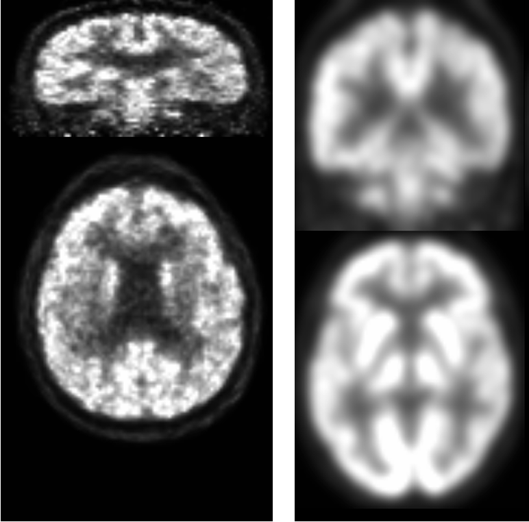
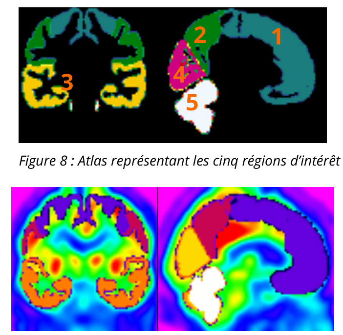
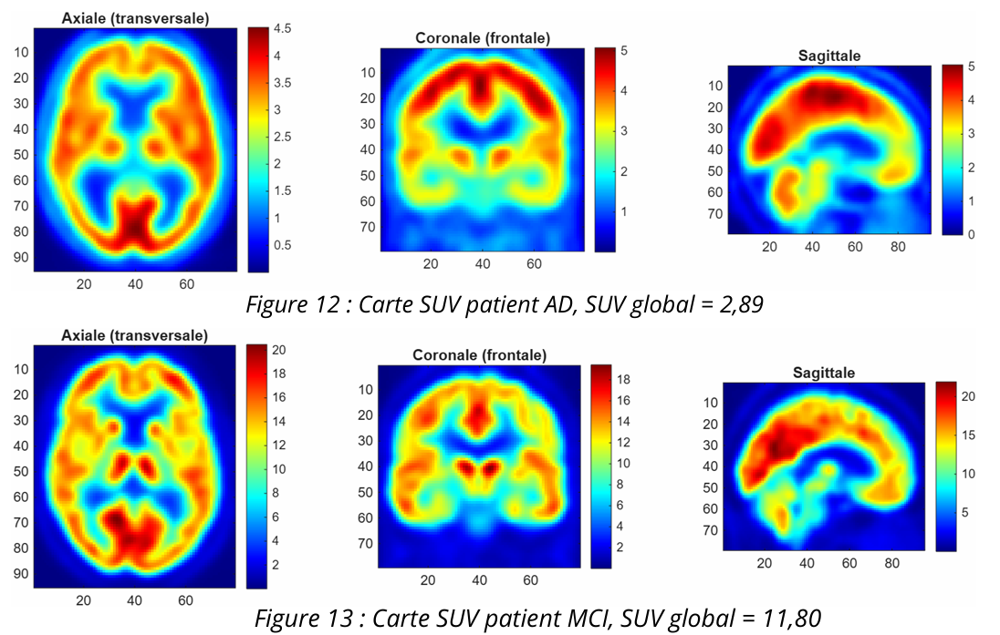
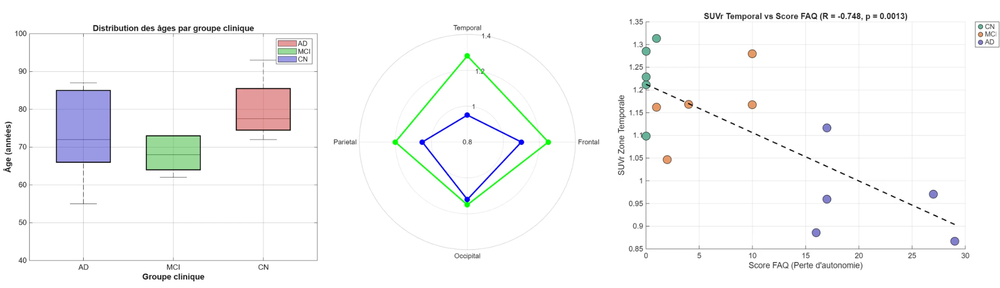
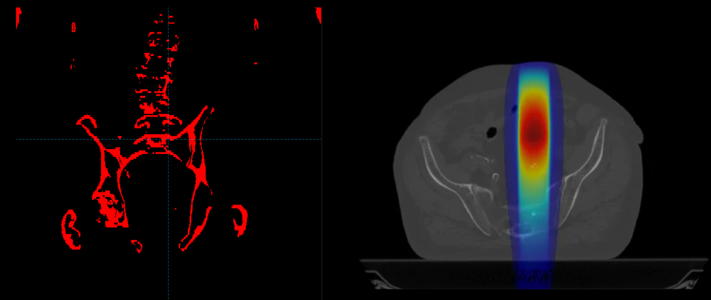
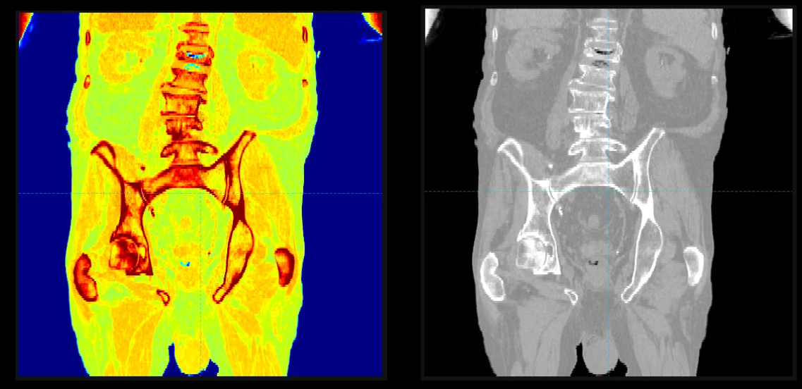
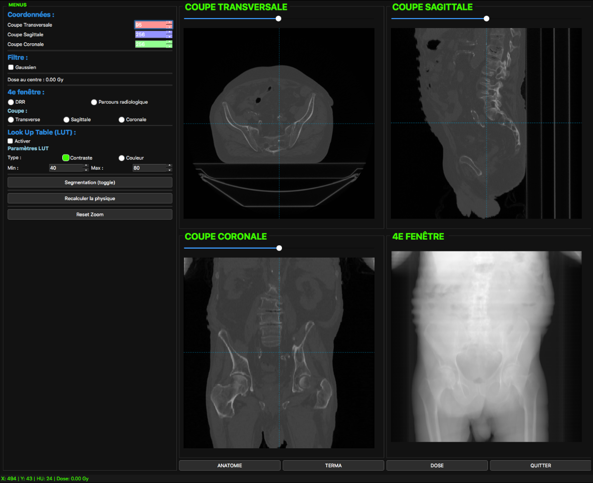
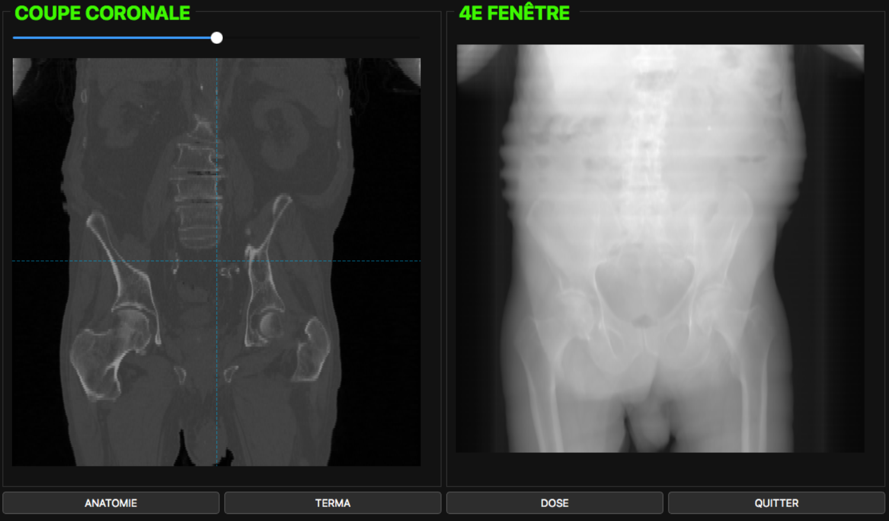

# Hegirziana Heva OBONE ESSONO

  <b>Étudiante en Master 2 Radiophysique Médicale</b> | <i>Medical Physics Master's Student</i> 
  Université de Toulouse - Faculté des Sciences et d'Ingénierie  
  📍 Toulouse, France | 📧 essono.heva@gmail.com

  <a href="#-français">Français</a> • <a href="#-english">English</a>

---

## 🇫🇷 Français

### 📄 Curriculum Vitae
* 📥 **[Télécharger mon CV complet (PDF)](./Stage_CV.pdf)**
* 📑 **Domaines :** Radiophysique Médicale, Dosimétrie, Imagerie Médicale & Traitement d'Images.

  
  
  

  
  
  
  
  

### 📌 À propos
Étudiante en Master 2 spécialisée en **physique médicale, dosimétrie et imagerie** (TEP, TEMP, IRM, Scanner, Échographie). Mon parcours associe la physique des rayonnements, la radiobiologie et le traitement d'images médicales à une pratique concrète en assurance qualité en radiothérapie, quantification métabolique TEP et développement logiciel en C++.

### 📂 Projets académiques

#### 🧠 1. Quantification métabolique cérébrale dans la maladie d'Alzheimer (TEP/IRM) 

  
* **Cadre :** Projet de Master 1 — *Toulouse NeuroImaging Center (ToNIC)* (Mars 2026 – Mai 2026)
* **Rapport détaillé format ieee :** [`Projet Quantification TEP`](./Quantification_TEP_French_ver.pdf)
* **Support de présentation orale :** [`Présentation Projet Quantification TEP`](./Presentation_Quantification_TEP.pdf)

  

* **Sujet :** Analyse TEP des biomarqueurs cérébraux...
* **Technique :**
  * Prétraitement de volumes cérébraux 3D sous **SPM12**.
* **Points clés :** 
  * Prétraitement de volumes cérébraux 3D sous **SPM12** (recalage spatial, normalisation MNI, interpolation).
  * Calcul des métriques SUV et SUVR (zone de référence : cervelet).
  * Analyse quantitative du métabolisme cérébral (cortex frontal, précunéus, cingulaire postérieur).

#### 💻 2. Interface de visualisation et de traitement d'images médicales (C++)

* **Cadre :** Projet de Master 1 — *Faculté des Sciences et d'Ingénierie, Toulouse* (Fév 2026 – Mai 2026)
* **Support de présentation orale :** [`Présentation Projet C++`](./C++_Project_presentation.pdf).

 

   

* **Points clés :** 
  * Développement d'une interface interactive de visualisation 3D de données scanner DICOM en C++.
  * Filtrage gaussien 2D par convolution, tables de correspondance (LUT / Palette Jet).
  * Simulation de faisceau de radiothérapie, reconstruction de radiographies numériques (DRR) et segmentation anatomique temps réel.

#### 🧬 3. Vectorisation et traitement de la maladie de Huntington
* **Cadre :** Projet de Licence — *Laboratoire SOFTMAT, Toulouse* (Sep 2024 – Jan 2025)
* **Rapport détaillé format IEEE :** [`Projet Vectorisation`](./Vectorisation_ieee.pdf)
* **Support de présentation orale :** [`Présentation Projet Vectorisation`](./Vectorisation_presentation.pdf)
* **Points clés :** 
  * Étude des stratégies de ciblage thérapeutique par vecteurs (AAV5/miRNA) franchissant la barrière hémato-encéphalique.
  * Analyse de données précliniques sur la réduction de la protéine mHTT.

### 🔬 Stages & Expériences
* **Stagiaire en Physique Médicale** | *Institut de Cancérologie d'Akanda (ICA)* (Juin 2026 – Juil 2026)

  * Assurance qualité sur LINAC, simulateur CT et calibrateur de dose ISOMED.
  * Contourage TPS (CTV, PTV) et balistique de traitement.

* **Stagiaire en Recherche** | *Groupe PRHE — Laboratoire LAPLACE* (Juin 2025 – Juil 2025)
  * Étude des plasmas froids et espèces réactives (ROS/RNS) pour la décontamination biologique.

---

## 🇬🇧 English

### 📄 Resume / CV
* 📥 **[Download full CV (PDF)](./Internship_resume.pdf)**
* 📑 **Fields:** Medical Physics, Dosimetry, Medical Imaging & Image Processing.

  
  
  

  
  
  
  
  

### 📌 About
Master's student in **Medical Radiation Physics** (PET, SPECT, MRI, CT, Ultrasound). My academic background combines radiation physics, radiobiology, and medical image processing with hands-on experience in radiotherapy QA, PET metabolic quantification, and C++ software development.

### 📂 Featured Projects

#### 🧠 1. Brain Metabolic Quantification in Alzheimer's Disease (PET/MRI)

* **Context:** Master 1 Project — *Toulouse NeuroImaging Center (ToNIC)* (Mar 2026 – May 2026)
* **Highlights:** 
  * 3D brain volume preprocessing using **SPM12** (spatial registration, MNI normalization, interpolation).
  * SUV and SUVR metrics calculation using the cerebellum as reference region.
  * Regional metabolic quantification in key brain areas (frontal cortex, precuneus, posterior cingulate).
* **Link:** [`TEP Quantification Project`](./Quantification_TEP_eng_ver.pdf)

#### 💻 2. Medical Image Visualization & Processing Interface (C++)

* **Context:** Master 1 Project — *Faculty of Science and Engineering, Toulouse* (Feb 2026 – May 2026)
* **Highlights:** 
  * Interactive 3D visualization tool for DICOM CT datasets built in C++.
  * Spatial convolution 2D Gaussian filter, custom Look-Up Tables (LUT / Jet Palette).
  * Radiotherapy beam simulation, Digitally Reconstructed Radiographs (DRR), and real-time tissue segmentation.
* **Link:** [`Qt Interface Project Presentation`](./C++_Project_presentation_eng.pdf)

#### 🧬 3. Vectorization Strategies in Huntington’s Disease
* **Context:** Bachelor's Project — *SOFTMAT Laboratory, Toulouse* (Sep 2024 – Jan 2025)
* **Highlights:** 
  * Literature review on targeted drug delivery platforms (AAV5/miRNA) crossing the blood-brain barrier.
  * Analysis of preclinical data regarding mHTT protein knockdown.
* **Link:** [`Vectorization Project Report`](./Vectorisation_ieee.pdf)
* **Link:** [`Vectorization Project Presentation`](./Vectorisation_presentation.pdf)

### 🔬 Clinical & Research Experience
* **Medical Physics Intern** | *Institut de Cancérologie d’Akanda (ICA)* (Jun 2026 – Jul 2026)

  * Quality assurance protocols on LINAC, CT Simulator, and ISOMED dose calibrators.
  * Treatment planning (TPS): OAR/CTV/PTV contouring and beam arrangement.
* **Research Intern** | *PRHE Group — LAPLACE Laboratory* (Jun 2025 – Jul 2025)
  * Cold plasma reactive species (ROS/RNS) for biological decontamination.

---

## 🛠️ Technical Skills / Compétences

| Domain / Domaine | Tools & Technologies / Outils |
| :--- | :--- |
| **Neuroimaging** | SPM12, MRIcron, MRIcroGL, MNI Space, SUVR |
| **Programming** | C, C++, MATLAB |
| **Environments** | VS Code, PyCharm, Qt Creator, Linux (Ubuntu), Windows |
| **Medical Physics** | Dosimetry, Radiotherapy QA, TPS Contouring, Radiobiology |
